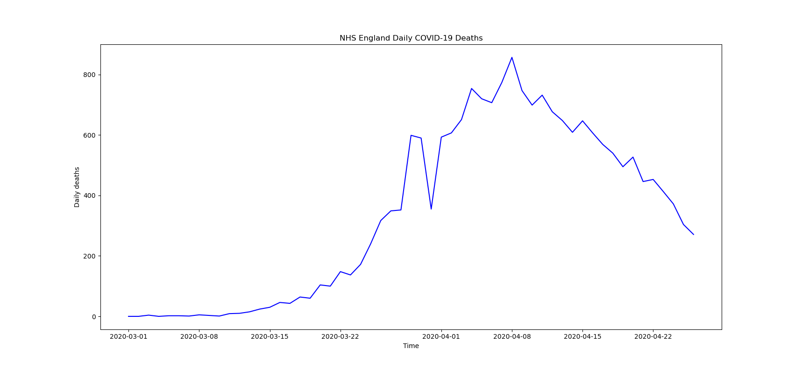

# NHS England Daily COVID-19 Deaths Chart

Python script that shows a chart representing daily deaths from COVID-19 in NHS England regions. All deaths are recorded against the date of death rather than the date the deaths were announced.

## Source
https://covid-nhse.develer.co.uk/

## How to use
1. Install dependencies by using `pip install -r requirements.txt`.
2. Launch `script.py`.
